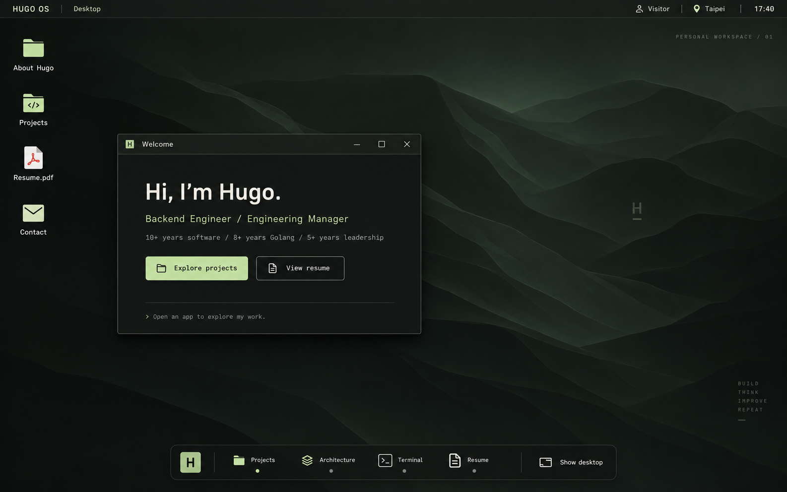
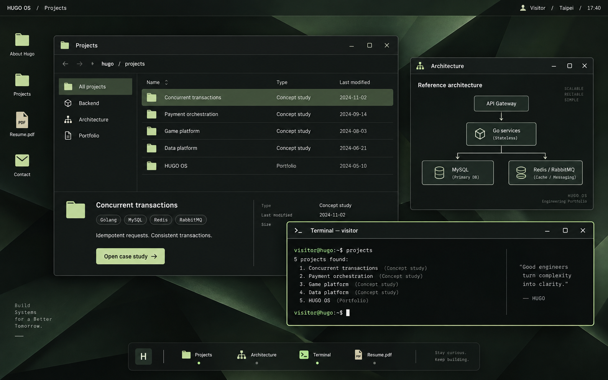

# HUGO OS 桌面改版規劃書

2026-09-13 · 設計提案 v1 · 尚未修改正式網站

## 1. 建議方向

把動畫後的主畫面改成「可操作的工程師桌面」。訪客進入 Hugo 的工作環境，透過應用程式認識經歷、作品與架構思考。以 **桌布、桌面捷徑、工作列、獨立視窗** 建立 OS 感；個人介紹和作品內容各自住進應用程式。

推薦採用自有的 HUGO OS 視覺：石墨黑底、淡鼠尾草綠重點色、精緻但克制的圖示與陰影。延續現有 3D 工作室和 BIOS 的氣質，視窗控制統一放在右上方。全站文案暫沿用英文，規劃說明使用繁體中文。

## 2. 現在為什麼不像作業系統

本次已讀取目前 HTML / CSS / JavaScript，並在本機瀏覽器點擊 Skip intro 檢視桌面。這是針對動畫後畫面的評估，沒有重新驗證整段運鏡。

| 現況 | 造成的感受 | 建議修改 |
| --- | --- | --- |
| 大型 Welcome 標題、固定四卡版面、整頁向下捲動 | 個人品牌網站／儀表板 | 桌面佔滿可視區，內容在各視窗內捲動 |
| 左側永久 Explorer 導覽，頂部外部連結 | 網站側欄和導覽列 | 捷徑移到桌面與工作列；Explorer 成為真正的檔案總管 |
| 首頁卡片有 `.exe` 標題，但仍固定在格線 | OS 裝飾多於操作模型 | 統一可移動、有焦點、有狀態的視窗框架 |
| 所有應用程式共用 `#app-dialog`，透過 `showModal()` 開啟 | 一次只看一個內容彈窗，背景被遮罩阻擋 | 桌面視窗獨立存在，切換焦點不遮住整個桌面 |
| 最小化目前呼叫 `closeApp()`，再提示重新開啟 | 缺乏工作列收納與恢復的空間連續性 | 最小化保留內容與捲動位置，點工作列原位恢復 |
| 首屏同時展開 About、Architecture、Projects、Terminal | 每個區塊都在爭奪注意力 | 初次只開一個小型 Welcome 視窗 |

現況截圖：[00-current.png](00-current.png)。

## 3. 視覺構成

### 桌面初始狀態

- **頂部系統列**：HUGO OS、目前應用程式名稱、Visitor、本地顯示時間／Taipei。高度約 36px；移除網站式大型職稱和外連導覽。
- **桌布**：低彩度深綠抽象摺面或等高線，淡淡的 H 識別，約半個畫面保有可辨識的背景。避免高亮霓虹、大面積網格和不停跳動的裝飾。
- **左侧捷徑**：About Hugo、Projects、Resume.pdf、Contact；每個圖示都有文字，按一下即可開啟。其他項目放進啟動器。
- **Welcome 視窗**：桌面偏左，約 470 × 330px 起始參考；顯示姓名、職稱、現有年資，以及 Explore projects / View resume 兩個明確入口。能關閉，不佔滿畫面。
- **底部工作列**：固定釘選 Projects、Architecture、Terminal、Resume，加上 H 啟動器與顯示桌面。開啟中、作用中、最小化須有可辨識的不同狀態。

桌面不能為了留白而讓人找不到內容。Welcome 的兩個入口、桌面捷徑的文字，以及工作列標籤都要保留。

### 多視窗工作狀態

Projects 是主要閱讀視窗；Architecture 可在旁邊查看；Terminal 可以浮在前景。最多預設鼓勵 2–3 個可見視窗，不自動一次展開所有應用程式。

視窗使用一致的標題列、右上控制、細邊框與底部路徑；只有作用中視窗強化邊框和陰影。背景視窗僅降低框架對比，內容仍可讀。標題列不使用三色交通燈，避免混用不同 OS 的控制語言。

### 視覺規格起點

| 元素 | 建議 |
| --- | --- |
| 桌面／視窗底色 | `#111412` / `#1B211D` |
| 強調／文字 | `#C3DC9B` / `#EEF1EA` |
| 次要文字 | `#ABB6AA`，實作時驗證不同底色下對比 |
| 字型 | 延用本地 Manrope；路徑、終端機使用系統等寬字型 |
| 文字尺寸 | 主要內容 14–16px；系統標籤 12–13px；不沿用大量 8–10px 說明文字 |
| 圓角與邊框 | 視窗 10–12px，1px 邊框；內容層不要每個區塊都套卡片 |
| 操作回饋 | 開啟／恢復約 160–220ms；最小化約 180ms；拖曳跟手 |
| 觸控 | 手機按鈕至少 44 × 44px；桌面小型圖示也提供足夠點擊區 |

上述色彩、尺寸與時間為本案設計起點，待實作畫面和可讀性測試調整。UI/UX 技能第一次搜尋回傳的一般 Hero 版型不符合本案，因此未採用；另查詢深色介面原則，採用克制光效、清楚焦點與高可讀性方向。

## 4. 內容如何搬進應用程式

| 應用程式 | 內容與主要行為 |
| --- | --- |
| About Hugo | 簡介、專長與現有年資；經歷時間軸放在同一應用內分頁 |
| Projects | 檔案總管：分類側欄、作品清單、預覽；開啟案例後顯示問題、角色、設計、取捨與結果 |
| Architecture | 架構圖工作區；點節點顯示說明，可與作品案例並排 |
| Database | 保留目前資料庫主題內容，由啟動器或 Architecture 導覽開啟 |
| Skills | 技術分類和使用脈絡，從啟動器開啟 |
| Terminal | 保留現有指令與歷史；執行 projects 時開啟／聚焦 Projects，Terminal 自己仍保留 |
| Resume.pdf | PDF 閱讀與下載；目前檔案仍明確標為摘要草稿 |
| Contact | Email／GitHub／LinkedIn，未提供的資料保留清楚的待補狀態 |

原本獨立的 Experience 可整合進 About，但保留 `#experience` 入口。四個架構案例仍標示 Concept study，不加入未提供的公司、績效、聯絡方式或線上系統數據。

## 5. 操作規則

1. **開啟**：桌面捷徑與工作列按一下；重複開同一 app 只聚焦現有視窗，不產生重複實例。
2. **焦點**：点击視窗置頂，工作列同步標示；鍵盤使用者也能經由工作列切換。
3. **移動與大小**：拖曳標題列，保證控制按鈕不離開畫面；提供最大化／還原，以及選單式「並排左／右」，避免只能靠拖曳。
4. **最小化**：隱藏視窗、保留內容與位置；工作列保留狀態與恢復入口。
5. **關閉**：關閉該 app，焦點回到上一視窗或來源按鈕；同次工作階段內保留必要閱讀狀態。
6. **捲動**：桌面固定；各 app 內容獨立捲動，切換與最小化不重設閱讀位置。
7. **搜尋與快捷鍵**：保留現有 Ctrl / Command + K 開啟 Terminal；新增可見啟動器入口，不搶用瀏覽器既有 Alt+Tab／Command+W 等組合。
8. **Escape**：先關閉選單／局部彈層，再對目前 app 生效；不一次關閉所有視窗。
9. **連結與返回**：支援既有 hash 直達；新規劃讓明確 app 導覽可被瀏覽器上一頁回復，拖曳／縮放不新增歷史。
10. **可及性**：一般桌面視窗不設整頁 modal focus trap；為標題與控制提供名稱，最小化視窗不進入 Tab 順序。只有真正需要阻擋操作的確認對話框使用 modal。

## 6. 動畫結束如何接上桌面

保留目前「工作室 → 主螢幕 → BIOS → System Ready」的捲動流程、鏡頭幾何與反向捲動邏輯。

最後接續改為：System Ready → 同一顯示區域淡入桌布 → 系統列與工作列出現 → Welcome 視窗進入。整段完成約 400–600ms，沒有第二次開機、登入表單或額外等待。

桌布保持相同視角與尺寸，不再次放大縮回；使用者快速捲動、按 Skip 或以深連結進入時，立即進入可操作狀態。減少動態效果偏好直接顯示穩定桌面。重播工作室時暫存／隱藏 app，回到桌面恢復，避免視窗殘留在 3D 開場上方。

## 7. 手機與平板

| 寬度起點 | 模型 |
| --- | --- |
| ≥ 1100px | 自由多視窗、工作列、桌面捷徑、左右並排 |
| 768–1099px | 一個主要 app + 切換列，可選全螢幕；不預設開三個重疊視窗 |
| < 768px | 手機桌面：app 圖示格 + 精簡歡迎內容；開啟 app 後單一全螢幕，頂部返回、底部常用入口 |

手機不把桌面等比例縮小；保留共同圖示、桌布和系統列，使用觸控可操作的導覽。App 內才捲動，鍵盤出現時 Terminal 輸入列仍可見；處理瀏海、安全區、直橫向旋轉。以上斷點待真實內容驗證。

手機布局示意：

```text
┌─────────────────────────┐
│ HUGO OS         Taipei  │
│                         │
│ Hi, I’m Hugo.           │
│ Backend Engineer        │
│ [Projects] [Resume]     │
│                         │
│  About      Projects    │
│  Resume     Contact     │
│                         │
│        深色桌布          │
│                         │
│ Home   Apps   Terminal  │
└─────────────────────────┘
       點 Projects ↓
┌─────────────────────────┐
│ ‹ Desktop    Projects   │
│ All / Backend / Web     │
│ Concurrent transactions │
│ Concept study           │
│ Payment orchestration   │
│ Concept study           │
│ ...內容在此區捲動...      │
│ Home   Apps   Terminal  │
└─────────────────────────┘
```

## 8. 實作分期與範圍

### P0｜建立 OS 感的必要骨架

桌布、桌面捷徑、工作列、Welcome；將單一 modal 改成獨立 app 容器；完成開啟、焦點、拖曳、最小化、恢復、最大化、關閉；先接 About、Projects、Terminal、Resume，手機同步提供單 app 模式。

**檢視點：** 動畫後一眼看出桌面，Projects 與 Terminal 能同時存在，履歷仍能快速找到。

### P1｜把內容真正變成應用程式

Projects 檔案總管與案例詳情、Architecture 並排查看；接回所有既有內容；完成啟動器、鍵盤路徑、hash 與返回、尺寸變動、終端機導航。

**檢視點：** 從初次進入、看作品、看架構到讀履歷，整條路徑可完成。

### P2｜細節與耐用性

最後 400–600ms 銜接、工作列恢復動畫、左右吸附、視窗尺寸拖曳、可選的本地版面記憶。只有確定需要時才增加桌布切換、右鍵選單或通知中心。

**暫不納入：** 登入帳號、真實檔案系統、後端、仿造硬體監控、聲音、垃圾桶、完整 OS 設定中心。這些對作品集瀏覽的收益較低。

不在提案階段給精確工期承諾；實作量主要集中在視窗狀態與鍵盤／行動版整合，而非換色。先交付 P0 的可操作版本，再確認 P1 / P2 細節。

## 9. 對現有程式的修改範圍

- `index.html`：替換 `#desktop` 內的網站式結構；將 `#app-dialog` 轉為視窗容器／模板。
- `styles.css`：建立桌面、工作列、視窗層級、可見焦點與手機布局；保留開場規則。
- `app.js`：以 app id 對應各視窗狀態，包含 visible / minimized / maximized、位置、層級、內容狀態；現有 renderers 改成在各自容器內查找元素，避免重複 ID 與全域選擇器衝突。
- `scene.js`：原則上沿用；新銜接只在 desktop 交接邊界整合，若日後確有需要再調整。
- `assets/`：必要時新增本地桌布與一致圖示；維持原生 HTML / CSS / JS、相對路徑及離線開啟，不新增框架或後端。

注意：現有 `activeApp`、`#app-content`、`selectedProject` 等為單一全域狀態，不能只複製 dialog 就當成多視窗；需要把渲染目標、事件和焦點管理一起整理。

## 10. 驗收清單

- 動畫後桌面沒有整頁長捲軸；Welcome、作品及履歷入口在首屏可見。
- 同時開 Projects / Architecture / Terminal；切換不關閉另一 app，沒有全畫面遮罩。
- 最小化後從工作列恢復：案例選擇、捲動位置、終端機歷史與輸入草稿維持。
- 拖曳、最大化還原、旋轉／縮放後，所有視窗控制仍在可操作範圍。
- 僅用鍵盤可開啟、切換、最大化、關閉；選单可離開，不困住焦點。
- 375px 手機、768px 平板、1280px 與 1440px 桌面實測；不出現橫向溢出與觸控遮擋。
- `#projects`、`#experience` 等直達與瀏覽器返回可用；Skip、重播、reduced-motion 路徑正常。
- PDF 和已填聯絡連結可用；缺資料不以假資訊補齊。
- 完整套用後重跑既有 `tests/intro-animation.cjs`，另針對視窗狀態、焦點恢復與導航做必要測試。

## 11. 本次交付

本規劃書、現況比較圖，以及兩張 AI 生成的高擬真概念圖。概念圖用於確認構圖、視窗關係與視覺方向；圖中文字、圖示、位置與控制细節屬示意，正式規格以本文件為準。

### 示意圖 01｜動畫結束後的桌面



### 示意圖 02｜作品、架構與終端機同時開啟



生成圖中的修改日期、引用句與額外裝飾標語並非已提供的個人資料，正式版不採用；前景視窗名稱與工作列指示也需依真實狀態同步。兩張圖主要用於討論空間與視覺方向。

生成方式與完整提示詞保存於 [IMAGE-PROMPTS.md](IMAGE-PROMPTS.md)。

本次只新增 `outputs/os-redesign-proposal/` 下的提案檔案。正式 `index.html`、`styles.css`、`app.js`、`scene.js` 保持現況。
